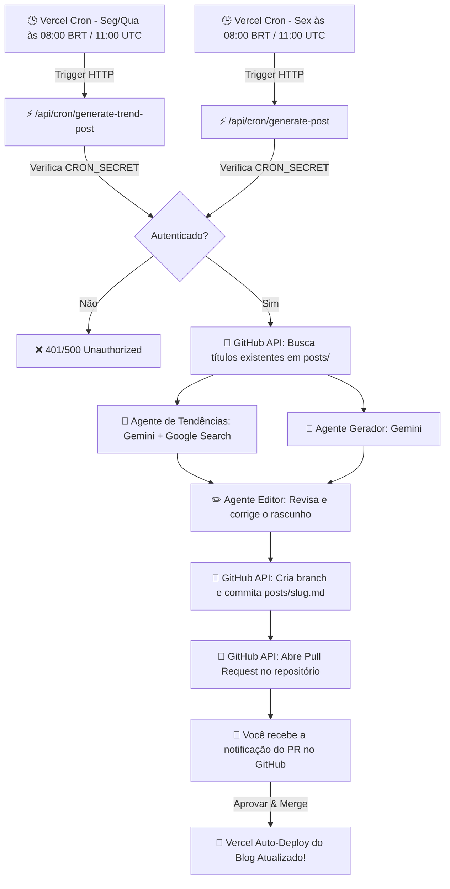

# 🚀 Next.js Blog - Publicador Autônomo de IA

Um blog moderno construído com **Next.js**, **Static Site Generation (SSG)** e arquivos **Markdown**, equipado com um **sistema autônomo multi-agente de geração de artigos por Inteligência Artificial**.

Três agentes colaboram via **Google Gemini API** e **Vercel Cron**: um **agente de tendências** que busca no Google as notícias mais recentes do ecossistema de IA (Seg/Qua), um **agente gerador** de artigos aprofundados sobre temas atemporais (Sex), e um **agente editor** que revisa e corrige todo rascunho antes de submetê-lo automaticamente como **Pull Request no GitHub** para sua aprovação e deploy via **Vercel**.

---

## 📑 Sumário

- [Destaques e Funcionalidades](#-destaques-e-funcionalidades)
- [Arquitetura do Sistema](#-arquitetura-do-sistema)
- [Estrutura do Projeto](#-estrutura-do-projeto)
- [Tecnologias Utilizadas](#-tecnologias-utilizadas)
- [Variáveis de Ambiente](#-variáveis-de-ambiente)
- [Como Rodar Localmente](#-como-rodar-localmente)
- [Testando o Gerador de IA Localmente](#-testando-o-gerador-de-ia-localmente)
- [Configuração de Deploy no Vercel](#-configuração-de-deploy-no-vercel)

---

## ✨ Destaques e Funcionalidades

- ⚡ **Next.js Static Generation (SSG)**: Desempenho ultrarrápido servindo páginas pré-renderizadas via CDN.
- 📝 **Postagens em Markdown com Frontmatter**: Gestão simples e flexível de conteúdo através de arquivos `.md` na pasta `posts/`.
- 🤖 **Três Agentes de IA Especializados**:
  - **🔥 Agente de Tendências** (Seg/Qua): busca no Google as notícias mais recentes do ecossistema de IA e escreve um artigo sobre elas, com fontes citadas.
  - **📚 Agente Gerador** (Sex): escreve artigos aprofundados e didáticos sobre temas atemporais do ecossistema de IA (LLMs, Agentes Autônomos, RAG, Engenharia de Prompt, Ética, etc.).
  - **✏️ Agente Editor**: revisa e corrige gramática, estrutura e consistência factual de todo rascunho antes de qualquer Pull Request ser aberto.
  - **Idioma**: Artigos gerados estritamente em **Português do Brasil**.
  - **Evita Tópicos Duplicados**: O sistema consulta os artigos existentes no repositório antes de gerar novos temas.
- 🔀 **Fluxo de Trabalho via Pull Request no GitHub**:
  - Cada agente cria seu próprio branch (`draft/trend-post-<slug>` ou `draft/ia-post-<slug>`) e commita o novo arquivo em `posts/`.
  - Abre automaticamente um **Pull Request no GitHub** com resumo do artigo e o selo de revisão do Agente Editor.
  - Ao aprovar e fazer o merge do PR, o Vercel realiza o **deploy automático** do novo post!

---

## 🏗️ Arquitetura do Sistema



---

## 📁 Estrutura do Projeto

```text
nextjs-blog/
├── components/          # Componentes React (Layout, Date, etc.)
├── docs/
│   └── VERCEL_CRON_SETUP.md  # Instruções detalhadas de configuração do Cron
├── lib/
│   ├── posts.js           # Utilitários para ler e parsear Markdown da pasta posts/
│   ├── cronAuth.js        # Autenticação compartilhada do CRON_SECRET
│   ├── githubPublisher.js # Slugify + branch/commit/PR compartilhados entre os agentes
│   └── editorAgent.js     # Agente Editor: revisa e corrige o rascunho antes do PR
├── pages/
│   ├── _app.js          # Encapsulador global da aplicação
│   ├── index.js         # Página inicial listando os posts
│   ├── api/
│   │   ├── hello.js
│   │   └── cron/
│   │       ├── generate-post.js       # Agente Gerador (Sex) + Gemini API + GitHub API
│   │       └── generate-trend-post.js # Agente de Tendências (Seg/Qua) + Google Search grounding
│   └── posts/
│       └── [id].js      # Rota dinâmica para exibição de artigos individuais
├── posts/               # Arquivos Markdown contendo as postagens do blog
│   ├── ssg-ssr.md
│   ├── pre-rendering.md
│   └── df-overview.md
├── public/              # Arquivos estáticos (imagens, favicons)
├── scripts/
│   ├── test-cron.js       # Testa o Agente Gerador (generate-post) localmente
│   └── test-trend-cron.js # Testa o Agente de Tendências (generate-trend-post) localmente
├── styles/              # Estilos CSS (Global e Módulos)
├── vercel.json          # Configuração dos dois Vercel Cron Schedules
├── .env.example         # Exemplo de variáveis de ambiente
├── package.json
└── README.md            # Documentação completa do projeto
```

---

## 🛠️ Tecnologias Utilizadas

- **Framework Web**: [Next.js 14](https://nextjs.org/) (React 18 LTS)
- **IA Generativa**: [@google/genai](https://www.npmjs.com/package/@google/genai) (Google Gemini 2.5 Flash API, com a ferramenta de Google Search grounding usada pelo Agente de Tendências)
- **Integração GitHub**: [@octokit/rest](https://www.npmjs.com/package/@octokit/rest) (GitHub REST API)
- **Parse de Markdown**: `gray-matter`, `remark`, `remark-html`
- **Datas**: `date-fns`
- **Hospedagem & Automação**: [Vercel](https://vercel.com/) (Vercel Cron & Deployments)

---

## 🔑 Variáveis de Ambiente

Crie um arquivo `.env.local` na raiz do projeto (utilize o [`.env.example`](./.env.example) como base):

```env
# Chave da API do Google Gemini (Gratuito em https://aistudio.google.com/)
GEMINI_API_KEY=sua_chave_gemini_aqui

# Token de Acesso Pessoal do GitHub (Com permissão 'repo' para criar branches e PRs)
GITHUB_TOKEN=seu_github_token_aqui

# Detalhes do Repositório GitHub
GITHUB_OWNER=eduardodarocha
GITHUB_REPO=nextjs-blog
GITHUB_BRANCH=main

# Token de Segurança do Vercel Cron
CRON_SECRET=seu_segredo_cron_aqui
```

---

## 💻 Como Rodar Localmente

1. **Instalar dependências**:
   ```bash
   npm install
   ```

2. **Iniciar o servidor de desenvolvimento**:
   ```bash
   npm run dev
   ```
   Acesse a aplicação em `http://localhost:3000`.

3. **Verificar a build de produção**:
   ```bash
   npm run build
   ```

---

## 🧪 Testando o Gerador de IA Localmente

Você pode simular a execução do Vercel Cron na sua máquina local:

1. Certifique-se de que o servidor local está rodando em um terminal (`npm run dev`).
2. Preencha o arquivo `.env.local` com suas chaves reais (`GEMINI_API_KEY` e `GITHUB_TOKEN`).
3. Em outro terminal, execute o comando de teste do agente desejado:
   ```bash
   npm run test:cron        # Agente Gerador (mesmo fluxo de Sexta-feira)
   npm run test:trend-cron  # Agente de Tendências (mesmo fluxo de Seg/Qua)
   ```
4. O script enviará a requisição para a rota correspondente, que chamará a IA do Gemini, o Agente Editor (que revisa e corrige o rascunho), gerará o post em Português e abrirá o Pull Request no seu GitHub!

---

## 🌐 Configuração de Deploy no Vercel

1. Suba as alterações para o seu repositório no **GitHub** (`git push origin main`).
2. Importe o projeto no [Vercel Dashboard](https://vercel.com/).
3. Vá em **`Settings > Environment Variables`** no Vercel e adicione (marcando o ambiente **Production**):
   - `GEMINI_API_KEY`
   - `GITHUB_TOKEN`
   - `CRON_SECRET`

   > ⚠️ As variáveis de ambiente são vinculadas ao deploy no momento do build. Depois de
   > adicionar ou alterar qualquer uma delas, **refaça o deploy de produção** — caso contrário
   > a função continuará enxergando o valor antigo (ou `undefined`, o que resulta em `401`).
4. O Vercel detectará automaticamente o arquivo [`vercel.json`](./vercel.json) e agendará **dois** Cron Jobs (o máximo permitido no plano Hobby):
   - `/api/cron/generate-trend-post` — **Segunda e Quarta às 11:00 UTC (08:00 BRT)**: Agente de Tendências.
   - `/api/cron/generate-post` — **Sexta às 11:00 UTC (08:00 BRT)**: Agente Gerador.

   > ℹ️ No plano **Hobby**, o Vercel dispara o Cron em qualquer momento dentro da hora
   > agendada (11:00–11:59 UTC / 08:00–08:59 BRT) para distribuir a carga entre as contas.

---

## 📄 Licença

Este projeto está sob a licença MIT. Sinta-se à vontade para utilizar e adaptar.
