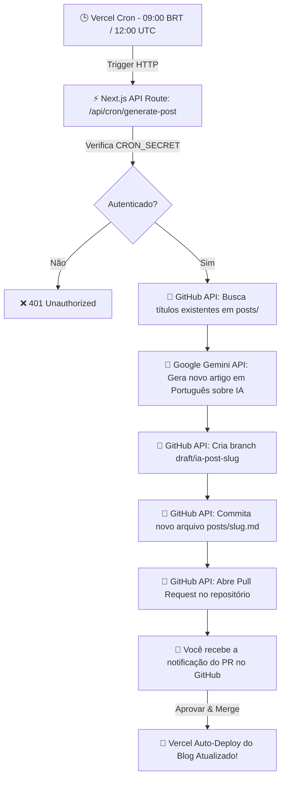

# 🚀 Next.js Blog - Publicador Autônomo Diário de IA

Um blog moderno construído com **Next.js**, **Static Site Generation (SSG)** e arquivos **Markdown**, equipado com um **sistema autônomo de geração diária de artigos por Inteligência Artificial**.

Diariamente, o sistema utiliza o **Google Gemini API** e **Vercel Cron** para criar artigos aprofundados em **Português do Brasil** focados no ecossistema de **Inteligência Artificial**, submetendo-os automaticamente como **Pull Requests no GitHub** para revisão e deploy via **Vercel**.

---

## 📑 Sumário

- [Destaques e Funcionalidades](#-destaques-e-funcionalidades)
- [Arquitetura do Sistema](#-arquitetura-do-sistema)
- [Estrutura do Projeto](#-estrutura-do-projeto)
- [Tecnologias Utilizadas](#-tecnologias-utilizadas)
- [Variáveis de Ambiente](#-variáveis-de-ambiente)
- [Como Rodar Localmente](#-como-rodar-localmente)
- [Testando o Gerador de IA Localmente](#-testando-o-gerador-de-ia-localmente)
- [Configuração de Deploy no Vercel](#-configuração-de-deploy-no-vercel)

---

## ✨ Destaques e Funcionalidades

- ⚡ **Next.js Static Generation (SSG)**: Desempenho ultrarrápido servindo páginas pré-renderizadas via CDN.
- 📝 **Postagens em Markdown com Frontmatter**: Gestão simples e flexível de conteúdo através de arquivos `.md` na pasta `posts/`.
- 🤖 **Geração Autônoma Diária via IA**:
  - **Foco Temático**: Ecossistema de IA (LLMs, Agentes Autônomos, RAG, Engenharia de Prompt, Ferramentas para Desenvolvedores, Ética e Tendências).
  - **Idioma**: Artigos gerados estritamente em **Português do Brasil**.
  - **Evita Tópicos Duplicados**: O sistema consulta os artigos existentes no repositório antes de gerar novos temas.
- 🔀 **Fluxo de Trabalho via Pull Request no GitHub**:
  - A rota `/api/cron/generate-post` cria um novo branch `draft/ia-post-<slug>`.
  - Abre automaticamente um **Pull Request no GitHub** com resumo do artigo.
  - Ao aprovar e fazer o merge do PR, o Vercel realiza o **deploy automático** do novo post!

---

## 🏗️ Arquitetura do Sistema



---

## 📁 Estrutura do Projeto

```text
nextjs-blog/
├── components/          # Componentes React (Layout, Date, etc.)
├── docs/
│   └── VERCEL_CRON_SETUP.md  # Instruções detalhadas de configuração do Cron
├── lib/
│   └── posts.js         # Utilitários para ler e parsear Markdown da pasta posts/
├── pages/
│   ├── _app.js          # Encapsulador global da aplicação
│   ├── index.js         # Página inicial listando os posts
│   ├── api/
│   │   ├── hello.js
│   │   └── cron/
│   │       └── generate-post.js # Rota Serverless do Vercel Cron + Gemini API + GitHub API
│   └── posts/
│       └── [id].js      # Rota dinâmica para exibição de artigos individuais
├── posts/               # Arquivos Markdown contendo as postagens do blog
│   ├── ssg-ssr.md
│   ├── pre-rendering.md
│   └── df-overview.md
├── public/              # Arquivos estáticos (imagens, favicons)
├── scripts/
│   └── test-cron.js     # Script auxiliar para testar a rota de IA localmente
├── styles/              # Estilos CSS (Global e Módulos)
├── vercel.json          # Configuração do Vercel Cron Schedule
├── .env.example         # Exemplo de variáveis de ambiente
├── package.json
└── README.md            # Documentação completa do projeto
```

---

## 🛠️ Tecnologias Utilizadas

- **Framework Web**: [Next.js 14](https://nextjs.org/) (React 18 LTS)
- **IA Generativa**: [@google/genai](https://www.npmjs.com/package/@google/genai) (Google Gemini 2.5 Flash API)
- **Integração GitHub**: [@octokit/rest](https://www.npmjs.com/package/@octokit/rest) (GitHub REST API)
- **Parse de Markdown**: `gray-matter`, `remark`, `remark-html`
- **Datas**: `date-fns`
- **Hospedagem & Automação**: [Vercel](https://vercel.com/) (Vercel Cron & Deployments)

---

## 🔑 Variáveis de Ambiente

Crie um arquivo `.env.local` na raiz do projeto (utilize o [`.env.example`](./.env.example) como base):

```env
# Chave da API do Google Gemini (Gratuito em https://aistudio.google.com/)
GEMINI_API_KEY=sua_chave_gemini_aqui

# Token de Acesso Pessoal do GitHub (Com permissão 'repo' para criar branches e PRs)
GITHUB_TOKEN=seu_github_token_aqui

# Detalhes do Repositório GitHub
GITHUB_OWNER=eduardodarocha
GITHUB_REPO=nextjs-blog
GITHUB_BRANCH=main

# Token de Segurança do Vercel Cron
CRON_SECRET=seu_segredo_cron_aqui
```

---

## 💻 Como Rodar Localmente

1. **Instalar dependências**:
   ```bash
   npm install
   ```

2. **Iniciar o servidor de desenvolvimento**:
   ```bash
   npm run dev
   ```
   Acesse a aplicação em `http://localhost:3000`.

3. **Verificar a build de produção**:
   ```bash
   npm run build
   ```

---

## 🧪 Testando o Gerador de IA Localmente

Você pode simular a execução do Vercel Cron na sua máquina local:

1. Certifique-se de que o servidor local está rodando em um terminal (`npm run dev`).
2. Preencha o arquivo `.env.local` com suas chaves reais (`GEMINI_API_KEY` e `GITHUB_TOKEN`).
3. Em outro terminal, execute o comando de teste:
   ```bash
   npm run test:cron
   ```
4. O script enviará a requisição para `http://localhost:3000/api/cron/generate-post`, chamará a IA do Gemini, gerará o post em Português e abrirá o Pull Request no seu GitHub!

---

## 🌐 Configuração de Deploy no Vercel

1. Suba as alterações para o seu repositório no **GitHub** (`git push origin main`).
2. Importe o projeto no [Vercel Dashboard](https://vercel.com/).
3. Vá em **`Settings > Environment Variables`** no Vercel e adicione:
   - `GEMINI_API_KEY`
   - `GITHUB_TOKEN`
   - `CRON_SECRET`
4. O Vercel detectará automaticamente o arquivo [`vercel.json`](./vercel.json) e agendará a execução diária do Cron para as **09:00 BRT (12:00 UTC)**.

---

## 📄 Licença

Este projeto está sob a licença MIT. Sinta-se à vontade para utilizar e adaptar.
